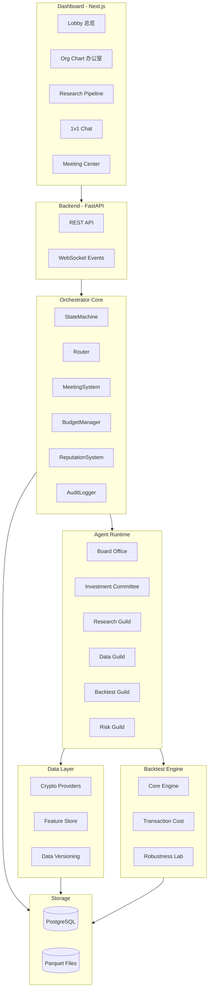
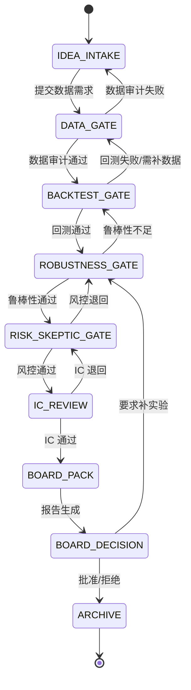

# AI Quant Company Multi-Agent 系统实现计划

## 系统架构总览



---

## Phase 0: 核心骨架 (3-5天)

### 1. 项目初始化与配置文件

创建项目根目录结构和核心配置：

**目录结构:**

```
ai-quant-company/
├── configs/
│   ├── agents.yaml          # 岗位定义、人设、权限、能力层
│   ├── models.yaml           # LLM 能力层到具体模型的映射
│   ├── permissions.yaml      # DM/会议/审批权限矩阵
│   ├── risk_limits.yaml      # 风险阈值配置
│   ├── scoring_weights.yaml  # 声誉评分权重
│   └── budget_policy.yaml    # 预算策略配置
├── orchestrator/
├── agents/
├── data/
├── backtest/
├── reports/
├── storage/
├── dashboard/
│   ├── api/                  # FastAPI 后端
│   └── web/                  # Next.js 前端
├── requirements.txt
├── pyproject.toml
└── README.md
```

### 2. 核心配置文件设计

**`configs/agents.yaml`** - 定义 18-24 个 Agent 岗位:

| 部门 | 角色 | Lead | 人数 | 能力层 | 风格人设 |

|------|------|------|------|--------|----------|

| Board Office | Chief of Staff | Yes | 1 | Reasoning | COO/流程控 |

| Board Office | Audit & Compliance | No | 1 | Reasoning | 合规审计 |

| Investment Committee | CIO | Yes | 1 | Reasoning | Dalio 风格 |

| Investment Committee | PM | Yes | 1 | Reasoning | 组合视角 |

| Research Guild | Head of Research | Yes | 1 | Reasoning | Simons 风格 |

| Research Guild | Alpha Team A | Yes | 3 | Reasoning | AQR 因子派 |

| Research Guild | Alpha Team B | Yes | 3 | Reasoning | 反叙事结构派 |

| Data Guild | Data Engineering | Yes | 2 | Coding | 工程严谨 |

| Data Guild | Data Quality Auditor | Yes | 1 | Reasoning | 一票否决 |

| Backtest Guild | Backtest Engineering | Yes | 1 | Coding | 可复现至上 |

| Backtest Guild | Transaction Cost Model | No | 1 | Coding | 现实主义 |

| Backtest Guild | Robustness Lab | No | 1 | Coding | 过拟合猎人 |

| Risk Guild | CRO Risk Manager | Yes | 1 | Reasoning | Howard Marks |

| Risk Guild | Skeptic | Yes | 1 | Reasoning | Munger 毒舌 |

| Risk Guild | Black Swan | No | 1 | Reasoning | 极端情景 |

**`configs/models.yaml`** - 三层能力映射:

```yaml
tiers:
  reasoning:  # 强推理/审查/权衡
    primary: claude-sonnet-4-20250514
    fallback: gpt-4o
  coding:     # 代码/工程/调试
    primary: gpt-4o
    fallback: gemini-2.0-flash
  reporting:  # 报告/可读性/结构
    primary: claude-sonnet-4-20250514
    fallback: gpt-4o

anti_homogeneity:  # 抗同质化配置
  research_team_a: gemini  # A 组用 Gemini 系
  research_team_b: openai  # B 组用 OpenAI 系
  veto_group: anthropic    # 否决组用 Anthropic
```

### 3. 状态机设计 (ResearchCycle)

**`orchestrator/state_machine.py`** - 核心状态流转:



**闸门规则:**

- `DATA_GATE`: Data Quality Auditor 一票否决权
- `RISK_SKEPTIC_GATE`: CRO 一票否决权, Skeptic 强制退回补实验权
- 每个 Gate 设置超时机制 (默认 24h)

### 4. 数据库 Schema

**`storage/schema.sql`** - 核心表结构:

```sql
-- 主要表
messages          -- Agent 间消息记录
events            -- 系统事件流
approvals         -- 会议/决策审批链
experiments       -- 实验记录 (ExperimentID, DataVersionHash, ConfigHash)
artifacts         -- 产物归档
budget_ledger     -- 预算点数流水
reputation_scores -- 声誉评分历史
research_cycles   -- 研究周期状态
meeting_requests  -- 会议申请队列
chairman_directives -- 董事长指令归档
```

### 5. 会议系统

**`orchestrator/meeting.py`** - 审批链实现:

```
申请 → Chief of Staff 初审 → CRO 复审(涉及风险时) → CIO 终审 → Chairman(High风险)
```

**MeetingRequest Schema:**

```python
@dataclass
class MeetingRequest:
    title: str
    goal: str  # 一句话目标
    agenda: List[str]  # 3-5 条议程
    participants: List[str]
    expected_artifacts: List[str]
    risk_level: Literal["L", "M", "H"]
    compute_cost_estimate: int
    duration_minutes: int = 20
```

---

## Phase 1: 闭环验证 (7-14天)

### 6. Agent Runtime 基础设施

**`agents/base.py`** - Agent 基类:

```python
class BaseAgent:
  - agent_id, role, department, is_lead
  - capability_tier (reasoning/coding/reporting)
  - persona (风格人设 prompt)
  - budget_remaining, reputation_score
  - send_dm(), receive_dm()
  - submit_memo(), request_meeting()
  - execute_task()
```

**Agent 分组:**

- `agents/leads/` - Lead 角色 (有会议申请权)
- `agents/research/` - 研究团队 A/B
- `agents/data/` - 数据工程 + 审计
- `agents/backtest/` - 回测 + 成本 + 鲁棒性
- `agents/risk/` - CRO + Skeptic + Black Swan
- `agents/board/` - Chief of Staff + Audit

### 7. 加密货币数据层

**`data/providers/crypto.py`** - 数据接入:

```python
class CryptoDataProvider(MarketDataProvider):
  - get_ohlcv(symbols, start, end, freq="1d")
  - get_funding_rates(symbols, start, end)  # 永续合约
  - supported: Binance API, CoinGecko (fallback)
```

**`data/versioning.py`** - 版本化:

```python
def compute_data_version_hash(ohlcv_df, features_df, config) -> str:
    # SHA256(ohlcv + features + config) → DataVersionHash
```

### 8. 轻量回测引擎

**`backtest/engine.py`** - 核心引擎:

**输入:**

- signals: 目标仓位或买卖信号
- prices: OHLCV 数据
- cost_model: 手续费/滑点/冲击模型
- constraints: 杠杆、仓位上限、换手限制

**输出 (标准产物):**

- `positions.parquet` - 每日持仓
- `trades.parquet` - 交易记录
- `equity_curve.parquet` - 净值曲线
- `metrics.json` - 年化/Sharpe/MaxDD/换手等
- `charts.json` - Plotly 图表数据
- `experiment_id` - 唯一实验标识

**`backtest/robustness.py`** - 鲁棒性实验:

- Walk-forward validation
- 参数扰动 (±10%, ±20%)
- 随机信号 baseline 对照
- 子样本稳定性 (牛/熊/震荡切分)

### 9. 报告生成器

**`reports/templates/board_pack.md.j2`** - 董事会报告模板 (2-5页):

```markdown
# {{ strategy_name }} 策略评审报告

## 结论与建议
{{ conclusion }}  <!-- Approve/Reject/Request More Tests -->

## 核心指标
| 指标 | 数值 |
|------|------|
| 年化收益 | {{ annualized_return }} |
| Sharpe Ratio | {{ sharpe }} |
| 最大回撤 | {{ max_drawdown }} |
| 成本后收益 | {{ net_return }} |

## 风险摘要
{{ risk_summary }}

## 策略逻辑 (非技术解读)
{{ strategy_explanation }}

## 上线条件
{{ launch_conditions }}

## 待董事会决定事项
{{ decision_items }}
```

**`reports/templates/research_report.md.j2`** - 研究报告 (10-30页):

- 完整实验设计与数据版本
- 所有对照实验结果
- 鲁棒性证据
- 成本敏感性分析
- ExperimentID 复现指引

---

## Phase 0 Dashboard (最小可用)

### 10. FastAPI 后端

**`dashboard/api/main.py`**:

```python
# 核心端点
GET  /api/lobby              # 总览指标
GET  /api/org-chart          # 组织架构与状态
GET  /api/pipeline           # 研究流水线
GET  /api/experiments        # 实验库
GET  /api/reports            # 报告库
GET  /api/meetings           # 会议队列
GET  /api/events             # 事件流 (SSE/WebSocket)
POST /api/chat/{agent_id}    # 1v1 对话
POST /api/directive          # 发布董事长指令
```

### 11. Next.js 前端

**核心页面:**

- `/` - Lobby (总览仪表盘)
- `/org-chart` - 办公室视图 (部门房间 + Agent 工位卡片)
- `/pipeline` - 研究流水线时间轴
- `/chat/[agent_id]` - 1v1 对话界面
- `/meetings` - 会议中心 (申请队列 + 审批)
- `/audit` - 审计日志回放

**设计风格:**

- 深色主题 (类 Bloomberg Terminal)
- 实时事件流 (WebSocket)
- 状态指示灯 (Agent 工作状态)

---

## 关键约束与铁律

### 通信限制

- 董事长只能 1v1 DM
- 多人会议必须走审批链
- 组内讨论走"回合制"(Lead 发 prompt → 组员 DM Lead → Lead 汇总)

### 资源稀缺

- Compute Points 预算制
- 回测/网格搜索消耗点数
- 预算耗尽只能写 memo

### 可复现四件套

- ExperimentID
- DataVersionHash
- CodeCommit
- ConfigHash

### 强制制衡

- A/B 同题赛马, Only-One-Advance
- Data Auditor 数据闸门否决
- CRO 风险闸门否决
- Skeptic 强制退回补实验

---

## 首批必写文件清单

| 优先级 | 文件 | 说明 |

|--------|------|------|

| P0 | `configs/agents.yaml` | 岗位、Lead、人数、风格、权限、能力层 |

| P0 | `configs/permissions.yaml` | DM 许可、会议申请资格、审批链 |

| P0 | `configs/models.yaml` | 能力层到 LLM 模型的映射 |

| P0 | `orchestrator/state_machine.py` | ResearchCycle 状态机 |

| P0 | `storage/schema.sql` | 数据库表结构 |

| P1 | `orchestrator/router.py` | 消息路由与权限检查 |

| P1 | `orchestrator/meeting.py` | 会议系统与审批链 |

| P1 | `orchestrator/budget.py` | 预算点数管理 |

| P1 | `agents/base.py` | Agent 基类 |

| P1 | `reports/templates/board_pack.md.j2` | 董事会报告模板 |

| P2 | `data/providers/crypto.py` | 加密货币数据接入 |

| P2 | `backtest/engine.py` | 轻量回测引擎 |

| P2 | `dashboard/api/main.py` | FastAPI 后端入口 |

---

## 预估工作量

- **Phase 0 (骨架)**: 3-5 天
                                - 配置文件 + 状态机 + 数据库 + 最小 Dashboard

- **Phase 1 (闭环)**: 7-14 天
                                - 数据接入 + 回测引擎 + 报告生成 + 完整 Agent Runtime

- **Phase 2 (增强)**: 后续迭代
                                - 重声誉系统 + PDF 报告 + 更多数据源