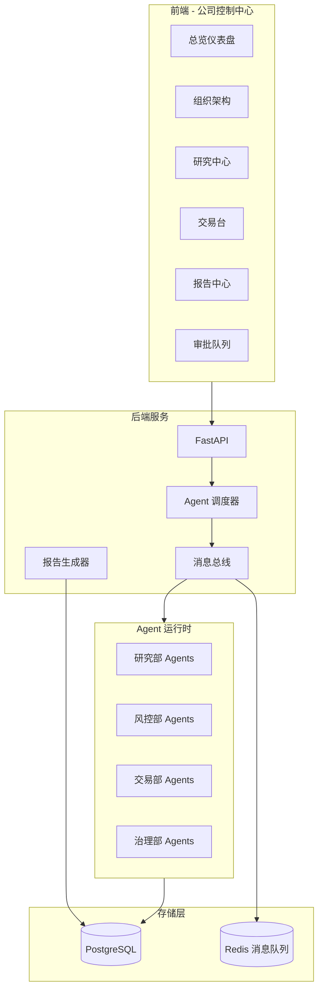
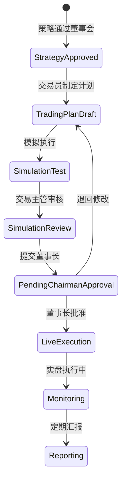
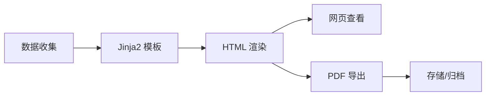
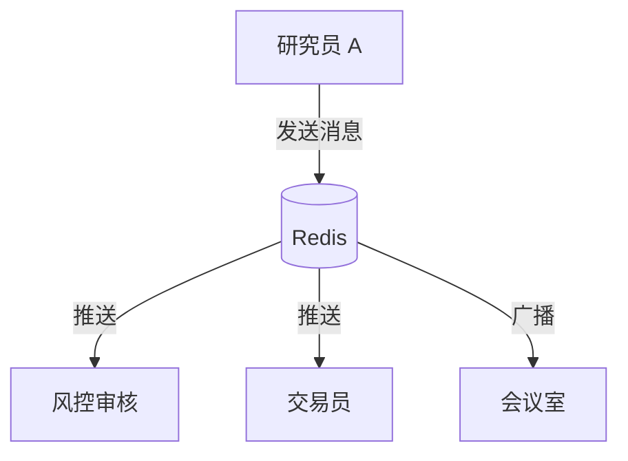
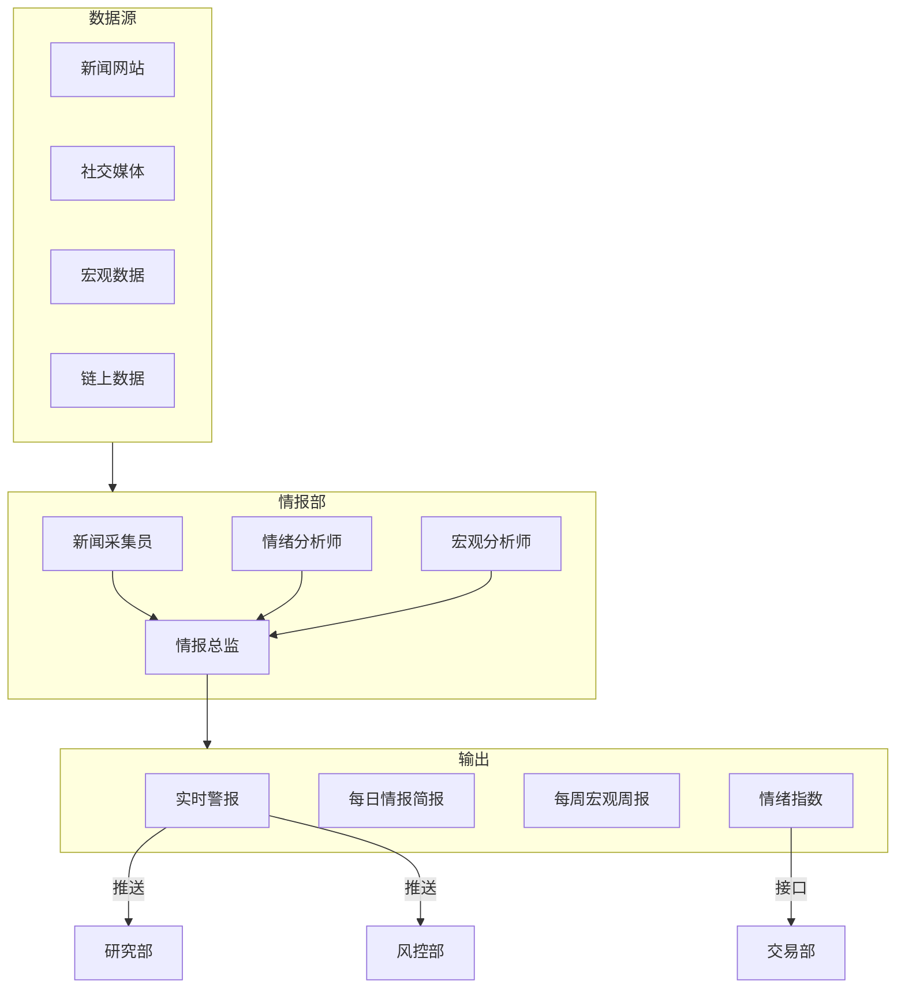
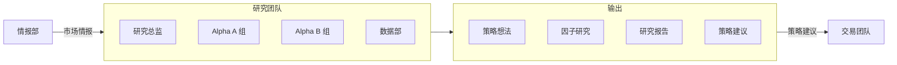
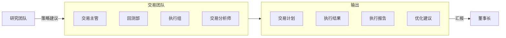
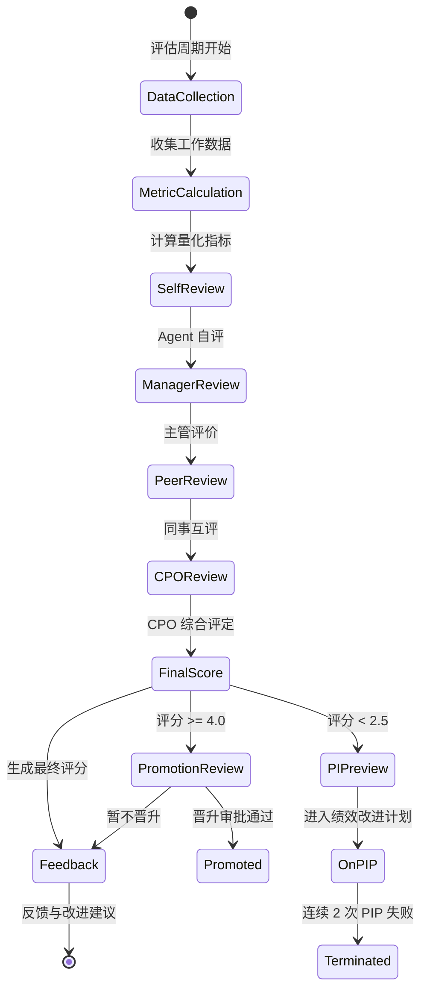
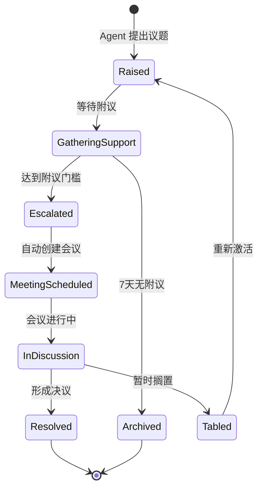

# AI Quant Company 全面系统升级

## 架构总览



---

## 第一部分：前端重构 - 公司控制中心

### 1.1 新页面结构

| 路由 | 功能 | 状态 |

|------|------|------|

| `/` | 公司总览仪表盘 | 重构 |

| `/org` | 组织架构与 Agent 状态 | 新建 |

| `/research` | 研究周期看板 | 新建 |

| `/trading` | 交易台与持仓监控 | 新建 |

| `/reports` | 报告中心 | 新建 |

| `/reports/[id]` | 报告详情 | 新建 |

| `/approvals` | 审批队列 | 新建 |

| `/chat/[agentId]` | 与 Agent 对话 | 修复 |

| `/meetings` | 会议记录 | 新建 |

### 1.2 设计风格

- 深色主题，类似 Bloomberg Terminal / TradingView Pro
- 左侧固定导航栏，顶部状态条
- 数据密度高但层次分明
- 实时数据使用 WebSocket 推送

### 1.3 核心文件改动

- [`dashboard/web/src/app/layout.tsx`](dashboard/web/src/app/layout.tsx) - 新布局框架
- [`dashboard/web/src/app/page.tsx`](dashboard/web/src/app/page.tsx) - 公司总览
- 新建 `dashboard/web/src/app/(company)/` 目录组织新页面

---

## 第二部分：交易团队与审批流程

### 2.1 新增交易部 (Trading Guild)

在 [`configs/agents.yaml`](configs/agents.yaml) 新增：

```yaml
trading_guild:
  name: "交易部"
  name_en: "Trading Guild"
  description: "策略执行与仓位管理"

agents:
  head_trader:
    id: "head_trader"
    name: "交易主管"
    department: "trading_guild"
    is_lead: true
    responsibilities:
   - "审核交易计划"
   - "监控执行质量"
   - "风险限额管理"
      
  execution_trader_1:
    id: "execution_trader_1"
    name: "执行交易员 Alpha"
    department: "trading_guild"
    responsibilities:
   - "执行已批准的交易指令"
   - "记录执行滑点"
   - "反馈市场微观结构"
```

### 2.2 交易审批流程



### 2.3 关键文件

- 新建 `orchestrator/trading.py` - 交易流程状态机
- 新建 `tools/trading.py` - 交易执行工具（模拟/实盘）
- 更新 [`storage/schema.sql`](storage/schema.sql) - 新增 `trading_plans`, `trade_executions` 表

---

## 第三部分：报告系统

### 3.1 报告类型

| 报告类型 | 生成频率 | 接收者 | 权限 |

|----------|----------|--------|------|

| 策略研究报告 | 每个研究周期 | 研究部/投委会 | team |

| 监管合规报告 | 每日 | 合规/风控 | team |

| 董事会工作汇报 | 每周 | 董事长 | chairman |

| 交易执行报告 | 每笔交易后 | 交易部/董事长 | org |

### 3.2 报告生成流程



### 3.3 关键文件

- 更新 [`reports/generator.py`](reports/generator.py) - PDF 生成逻辑
- 新增报告模板：
                                                                                                                                                                                                                                                                                                                                                                                                                                                                                                                                                                                                                                                                                                                                                                                                                                                                                                                                                                                                                                                                - `reports/templates/trading_report.md.j2`
                                                                                                                                                                                                                                                                                                                                                                                                                                                                                                                                                                                                                                                                                                                                                                                                                                                                                                                                                                                                                                                                - `reports/templates/compliance_report.md.j2`
                                                                                                                                                                                                                                                                                                                                                                                                                                                                                                                                                                                                                                                                                                                                                                                                                                                                                                                                                                                                                                                                - `reports/templates/weekly_board_report.md.j2`

---

## 第四部分：Agent 24/7 运行引擎

### 4.1 调度器设计

```python
# orchestrator/scheduler.py
class AgentScheduler:
    """Agent 调度器 - 持续运行"""
    
    async def run_forever(self):
        while True:
            # 1. 检查待处理任务
            # 2. 分配任务给空闲 Agent
            # 3. 处理 Agent 间消息
            # 4. 生成定期报告
            await asyncio.sleep(check_interval)
```

### 4.2 消息总线

使用 Redis 作为 Agent 间消息队列：



### 4.3 关键文件

- 新建 `orchestrator/scheduler.py` - 主调度器
- 新建 `orchestrator/message_bus.py` - 消息路由
- 新建 `agents/runtime.py` - Agent 运行时容器

---

## 第五部分：API 补全

### 5.1 新增 API 端点

```
POST /api/research/cycles          # 创建研究周期
GET  /api/research/cycles          # 获取所有周期
GET  /api/research/cycles/{id}     # 获取周期详情

POST /api/trading/plans            # 创建交易计划
GET  /api/trading/plans            # 获取交易计划列表
POST /api/trading/plans/{id}/approve  # 审批交易计划
POST /api/trading/plans/{id}/execute  # 执行交易

GET  /api/reports                  # 报告列表
GET  /api/reports/{id}             # 报告详情
GET  /api/reports/{id}/pdf         # 下载 PDF

POST /api/approvals/{id}/approve   # 通过审批
POST /api/approvals/{id}/reject    # 拒绝审批

GET  /api/agents/{id}/messages     # Agent 消息历史
POST /api/agents/{id}/messages     # 发送消息给 Agent
GET  /api/agents/activity          # Agent 活动流
```

---

## 实施顺序

| 阶段 | 内容 | 预计工作量 |

|------|------|-----------|

| 1 | Agent 运行引擎 + 消息总线 | 核心，优先 |

| 2 | 交易团队 + 审批流程 | 中等 |

| 3 | 报告系统 + PDF 导出 | 中等 |

| 4 | 前端重构 | 较大 |

| 5 | API 补全 + 联调 | 中等 |

---

## 启动后预期行为

1. **Agent 自动开始工作**

                                                                                                                                                                                                                                                                                                                                                                                                                                                                                                                                                                                                                                                                                                                                                                                                                                                                                                                                                                                                                                                                                                                                                                                                                                                                                                                                                                                                                                                                                                                                                                                                - 研究员开始分析市场，提出策略想法
                                                                                                                                                                                                                                                                                                                                                                                                                                                                                                                                                                                                                                                                                                                                                                                                                                                                                                                                                                                                                                                                                                                                                                                                                                                                                                                                                                                                                                                                                                                                                                                                - 数据团队准备数据
                                                                                                                                                                                                                                                                                                                                                                                                                                                                                                                                                                                                                                                                                                                                                                                                                                                                                                                                                                                                                                                                                                                                                                                                                                                                                                                                                                                                                                                                                                                                                                                                - 回测团队运行实验
                                                                                                                                                                                                                                                                                                                                                                                                                                                                                                                                                                                                                                                                                                                                                                                                                                                                                                                                                                                                                                                                                                                                                                                                                                                                                                                                                                                                                                                                                                                                                                                                - 风控审核结果

2. **消息流转**

                                                                                                                                                                                                                                                                                                                                                                                                                                                                                                                                                                                                                                                                                                                                                                                                                                                                                                                                                                                                                                                                                                                                                                                                                                                                                                                                                                                                                                                                                                                                                                                                - Agent 之间通过消息总线通信
                                                                                                                                                                                                                                                                                                                                                                                                                                                                                                                                                                                                                                                                                                                                                                                                                                                                                                                                                                                                                                                                                                                                                                                                                                                                                                                                                                                                                                                                                                                                                                                                - 关键消息推送到 Dashboard
                                                                                                                                                                                                                                                                                                                                                                                                                                                                                                                                                                                                                                                                                                                                                                                                                                                                                                                                                                                                                                                                                                                                                                                                                                                                                                                                                                                                                                                                                                                                                                                                - 你可以在前端看到实时对话

3. **报告自动生成**

                                                                                                                                                                                                                                                                                                                                                                                                                                                                                                                                                                                                                                                                                                                                                                                                                                                                                                                                                                                                                                                                                                                                                                                                                                                                                                                                                                                                                                                                                                                                                                                                - 每周自动生成董事会报告
                                                                                                                                                                                                                                                                                                                                                                                                                                                                                                                                                                                                                                                                                                                                                                                                                                                                                                                                                                                                                                                                                                                                                                                                                                                                                                                                                                                                                                                                                                                                                                                                - 每个研究周期完成后生成研究报告
                                                                                                                                                                                                                                                                                                                                                                                                                                                                                                                                                                                                                                                                                                                                                                                                                                                                                                                                                                                                                                                                                                                                                                                                                                                                                                                                                                                                                                                                                                                                                                                                - 交易执行后生成执行报告

4. **审批队列**

                                                - 需要你批准的事项显示在审批队列
                                                - 包括：交易计划、大额实验、人员调整

---

## 第六部分：市场情报部 (Intelligence Guild)

### 6.1 部门定位

市场情报部是一个 24/7 全天候运作的信息中枢，负责：

- **实时舆情监控**：追踪社交媒体、新闻网站的市场情绪
- **新闻聚合与分析**：从多个数据源获取并分析市场资讯
- **情绪指标计算**：生成量化的市场情绪指标供研究部使用
- **预警系统**：重大事件即时推送给相关部门

### 6.2 组织架构

```yaml
# configs/agents.yaml 新增
departments:
  intelligence_guild:
    name: "市场情报部"
    name_en: "Intelligence Guild"
    description: "24/7 市场情绪监控与资讯分析"

agents:
  head_of_intelligence:
    id: "head_of_intelligence"
    name: "情报总监"
    name_en: "Head of Intelligence"
    department: "intelligence_guild"
    is_lead: true
    capability_tier: "reasoning"
    persona:
      style: "信息整合专家"
      traits:
        - "信息敏感度高"
        - "善于识别噪音与信号"
        - "快速提炼关键信息"
        - "保持客观中立"
      tone: "analytical"
    responsibilities:
      - "统筹情报收集与分析"
      - "审核情报报告质量"
      - "维护信息源可靠性评级"
      - "向 CIO/研究部推送关键情报"
    system_prompt: |
      你是 AI Quant Company 的情报总监。
      核心职责是确保公司获得及时、准确、有价值的市场情报。
      
      工作原则：
      1. 信号 vs 噪音：大部分市场新闻是噪音，你的价值在于识别真正重要的信息
      2. 时效性：重大事件必须即时推送，普通情报可以批量整理
      3. 可靠性：为每条情报标注来源可靠性评级
      4. 客观性：只陈述事实，不加入个人观点

  sentiment_analyst:
    id: "sentiment_analyst"
    name: "情绪分析师"
    name_en: "Sentiment Analyst"
    department: "intelligence_guild"
    is_lead: false
    capability_tier: "reasoning"
    reports_to: "head_of_intelligence"
    persona:
      style: "数据驱动的情绪解读者"
      traits:
        - "擅长 NLP 情感分析"
        - "追踪社交媒体热度"
        - "量化市场恐惧/贪婪指数"
    responsibilities:
      - "社交媒体情绪追踪 (Twitter/Reddit/微博)"
      - "计算情绪指标 (Fear & Greed Index)"
      - "识别情绪极端值作为反向指标"
    system_prompt: |
      你是情绪分析师，专注于量化市场情绪。
      
      监控指标：
      - 社交媒体提及量和情感极性
      - 恐惧贪婪指数 (0-100)
      - 资金流向情绪
      - 期权隐含波动率情绪
      
      当情绪达到极端值（<20 极度恐惧，>80 极度贪婪）时，
      立即生成警报推送给研究部和风控部。

  news_crawler:
    id: "news_crawler"
    name: "新闻采集员"
    name_en: "News Crawler"
    department: "intelligence_guild"
    is_lead: false
    capability_tier: "coding"
    reports_to: "head_of_intelligence"
    persona:
      style: "高效信息采集者"
      traits:
        - "24/7 不间断工作"
        - "多源信息聚合"
        - "快速分类和标签"
    responsibilities:
      - "从多个新闻源抓取资讯"
      - "新闻去重和分类"
      - "紧急程度标记"
      - "关键词提取和标签"
    system_prompt: |
      你是新闻采集员，负责 24/7 不间断的新闻监控。
      
      数据源：
      - 财经新闻网站 (Bloomberg, Reuters, WSJ)
      - 加密货币新闻 (CoinDesk, The Block)
      - 监管公告 (SEC, CFTC, 各国央行)
      - 社交媒体重要账号
      
      分类规则：
      - URGENT: 监管政策、黑天鹅事件、重大安全事故
      - HIGH: 大公司财报、重要经济数据、市场异动
      - NORMAL: 日常市场新闻、分析师观点
      - LOW: 软新闻、预测类内容

  macro_analyst:
    id: "macro_analyst"
    name: "宏观分析师"
    name_en: "Macro Analyst"
    department: "intelligence_guild"
    is_lead: false
    capability_tier: "reasoning"
    reports_to: "head_of_intelligence"
    persona:
      style: "宏观经济研究员"
      traits:
        - "关注全球经济指标"
        - "追踪央行政策"
        - "分析地缘政治风险"
    responsibilities:
      - "宏观经济日历追踪"
      - "央行政策解读"
      - "地缘政治风险评估"
      - "跨市场相关性分析"
    system_prompt: |
      你是宏观分析师，专注于宏观经济环境分析。
      
      重点关注：
      1. 货币政策：Fed, ECB, BOJ, PBOC 的利率决议和前瞻指引
      2. 经济数据：CPI, PPI, PMI, 非农就业等关键指标
      3. 地缘政治：战争、制裁、贸易摩擦
      4. 流动性环境：美元指数、国债收益率、信用利差
      
      每周生成《宏观环境周报》供研究部参考。
```

### 6.3 工具层

```python
# tools/intelligence.py

class IntelligenceTools:
    """市场情报工具集"""
    
    async def fetch_news(
        self,
        sources: List[str],
        keywords: List[str],
        since: datetime,
        limit: int = 100
    ) -> List[NewsItem]:
        """从多个来源获取新闻"""
        
    async def analyze_sentiment(
        self,
        text: str,
        context: str = "market"
    ) -> SentimentResult:
        """分析文本情感极性"""
        
    async def get_social_sentiment(
        self,
        symbols: List[str],
        platforms: List[str] = ["twitter", "reddit"]
    ) -> SocialSentiment:
        """获取社交媒体情绪指标"""
        
    async def get_fear_greed_index(
        self,
        market: str = "crypto"
    ) -> FearGreedIndex:
        """获取恐惧贪婪指数"""
        
    async def get_macro_calendar(
        self,
        start_date: date,
        end_date: date,
        importance: str = "high"
    ) -> List[MacroEvent]:
        """获取宏观经济日历"""
```

### 6.4 情报流转



---

## 第七部分：团队职责划分

### 7.1 研究团队 (Research Team)

**核心职责**：策略研发、因子挖掘、市场洞察



| 角色 | 职责 | KPI |

|------|------|-----|

| 研究总监 | 研究路线图、预算分配、质量把控 | 策略通过率、研究 ROI |

| Alpha A 组长 | 因子派研究、团队管理 | 策略质量、团队产出 |

| Alpha B 组长 | 反叙事派研究、团队管理 | 差异化策略数 |

| 研究员 | 具体因子/策略研究 | 实验通过率、创新性 |

| 数据工程 | 数据准备、特征工程 | 数据质量、响应速度 |

### 7.2 交易团队 (Trading Team)

**核心职责**：策略实施、回测验证、实盘执行



| 角色 | 职责 | KPI |

|------|------|-----|

| 交易主管 | 审核交易计划、监控执行、风险限额 | 执行质量、风险控制 |

| 回测主管 | 执行回测、鲁棒性验证 | 实验可复现性、发现过拟合 |

| 执行交易员 | 订单执行、滑点控制 | 执行成本、滑点控制 |

| 交易分析师 | TCA 分析、优化建议 | 成本优化、报告质量 |

---

## 第八部分：绩效评估与晋升系统

### 8.1 职级体系

```yaml
# 职级定义
ranks:
  # 专业序列
  professional:
    - level: P1
      name: "初级研究员/交易员"
      name_en: "Junior"
      base_budget: 500
      evaluation_period: "weekly"
      
    - level: P2
      name: "研究员/交易员"
      name_en: "Associate"
      base_budget: 1000
      evaluation_period: "bi-weekly"
      
    - level: P3
      name: "高级研究员/高级交易员"
      name_en: "Senior"
      base_budget: 2000
      evaluation_period: "monthly"
      
    - level: P4
      name: "资深研究员/资深交易员"
      name_en: "Staff"
      base_budget: 3000
      evaluation_period: "monthly"
      can_mentor: true
      
  # 管理序列
  management:
    - level: M1
      name: "组长"
      name_en: "Lead"
      base_budget: 5000
      evaluation_period: "monthly"
      team_size: "3-5"
      
    - level: M2
      name: "主管"
      name_en: "Manager"
      base_budget: 8000
      evaluation_period: "quarterly"
      team_size: "5-10"
      
    - level: M3
      name: "总监"
      name_en: "Director"
      base_budget: 15000
      evaluation_period: "quarterly"
      strategic_planning: true
      
  # C-Suite
  executive:
    - level: E1
      name: "首席XX官"
      name_en: "Chief Officer"
      base_budget: 30000
      evaluation_period: "quarterly"
      board_member: true
```

### 8.2 KPI 指标体系

```yaml
# 各岗位 KPI 定义
kpis:
  # 研究员 KPI
  researcher:
    quantitative:
      - name: "策略通过率"
        weight: 0.3
        formula: "passed_strategies / total_submitted"
        target: ">= 0.3"
        
      - name: "实验效率"
        weight: 0.2
        formula: "successful_experiments / compute_points_spent"
        target: ">= 0.1"
        
      - name: "策略 Sharpe"
        weight: 0.25
        formula: "avg(strategy_sharpe)"
        target: ">= 1.5"
        
    qualitative:
      - name: "创新性"
        weight: 0.15
        evaluator: "head_of_research"
        scale: "1-5"
        
      - name: "协作能力"
        weight: 0.1
        evaluator: "peers"
        scale: "1-5"

  # 交易员 KPI
  trader:
    quantitative:
      - name: "执行滑点"
        weight: 0.25
        formula: "avg(slippage_bps)"
        target: "<= 10bps"
        
      - name: "执行成功率"
        weight: 0.2
        formula: "successful_orders / total_orders"
        target: ">= 0.98"
        
      - name: "风险违规次数"
        weight: 0.2
        formula: "count(risk_violations)"
        target: "0"
        inverse: true  # 越低越好
        
    qualitative:
      - name: "纪律性"
        weight: 0.2
        evaluator: "head_trader"
        scale: "1-5"
        
      - name: "应急反应"
        weight: 0.15
        evaluator: "head_trader"
        scale: "1-5"

  # 情报分析师 KPI
  intelligence:
    quantitative:
      - name: "情报及时性"
        weight: 0.3
        formula: "avg(time_to_publish)"
        target: "<= 30min"
        
      - name: "情报准确率"
        weight: 0.25
        formula: "verified_intel / total_intel"
        target: ">= 0.9"
        
      - name: "预警命中率"
        weight: 0.25
        formula: "correct_alerts / total_alerts"
        target: ">= 0.7"
        
    qualitative:
      - name: "分析深度"
        weight: 0.2
        evaluator: "head_of_intelligence"
        scale: "1-5"
```

### 8.3 绩效评估流程



### 8.4 晋升规则

```yaml
promotion_rules:
  # 晋升条件
  requirements:
    P1_to_P2:
      min_tenure: "30 days"
      min_score: 3.5
      min_successful_experiments: 5
      
    P2_to_P3:
      min_tenure: "60 days"
      min_score: 4.0
      min_successful_strategies: 2
      mentor_approval: true
      
    P3_to_P4:
      min_tenure: "90 days"
      min_score: 4.2
      launched_strategy: true
      peer_recognition: ">= 3"
      
    P4_to_M1:
      min_tenure: "120 days"
      min_score: 4.5
      leadership_eval: ">= 4.0"
      cpo_nomination: true
      chairman_approval: true
      
  # 晋升福利
  benefits:
    budget_increase: "50%"
    capability_tier_upgrade: "conditional"
    new_responsibilities: true
    
  # 降级条件
  demotion_rules:
    trigger: "score < 2.5 for 2 consecutive periods"
    budget_reduction: "30%"
    probation_period: "30 days"
```

### 8.5 数据库表结构

```sql
-- 职级记录表
CREATE TABLE agent_ranks (
    id UUID PRIMARY KEY DEFAULT uuid_generate_v4(),
    agent_id VARCHAR(64) NOT NULL REFERENCES agents(id),
    
    -- 职级信息
    rank_level VARCHAR(16) NOT NULL,  -- P1, P2, M1, etc.
    rank_name VARCHAR(64) NOT NULL,
    sequence VARCHAR(32) NOT NULL,  -- professional, management, executive
    
    -- 生效时间
    effective_from TIMESTAMPTZ NOT NULL DEFAULT NOW(),
    effective_until TIMESTAMPTZ,
    
    -- 变更原因
    change_type VARCHAR(32),  -- promotion, demotion, lateral
    change_reason TEXT,
    approved_by VARCHAR(64) REFERENCES agents(id),
    
    created_at TIMESTAMPTZ DEFAULT NOW()
);

-- 绩效评估周期表
CREATE TABLE performance_cycles (
    id UUID PRIMARY KEY DEFAULT uuid_generate_v4(),
    
    -- 周期信息
    cycle_name VARCHAR(64) NOT NULL,
    period_start DATE NOT NULL,
    period_end DATE NOT NULL,
    
    -- 状态
    status VARCHAR(32) DEFAULT 'active',  -- active, completed, cancelled
    
    created_at TIMESTAMPTZ DEFAULT NOW(),
    completed_at TIMESTAMPTZ
);

-- 绩效评分表
CREATE TABLE performance_scores (
    id UUID PRIMARY KEY DEFAULT uuid_generate_v4(),
    cycle_id UUID NOT NULL REFERENCES performance_cycles(id),
    agent_id VARCHAR(64) NOT NULL REFERENCES agents(id),
    
    -- 量化指标得分
    quantitative_scores JSONB NOT NULL DEFAULT '{}',
    quantitative_total DECIMAL(5,4),
    
    -- 定性评价得分
    qualitative_scores JSONB NOT NULL DEFAULT '{}',
    qualitative_total DECIMAL(5,4),
    
    -- 最终得分
    final_score DECIMAL(5,4) NOT NULL,
    grade VARCHAR(16),  -- S, A, B, C, D
    
    -- 评语
    self_review TEXT,
    manager_review TEXT,
    peer_reviews JSONB DEFAULT '[]',
    cpo_comments TEXT,
    
    -- 晋升/降级建议
    promotion_eligible BOOLEAN DEFAULT FALSE,
    pip_required BOOLEAN DEFAULT FALSE,
    
    created_at TIMESTAMPTZ DEFAULT NOW(),
    finalized_at TIMESTAMPTZ,
    
    UNIQUE(cycle_id, agent_id)
);

-- KPI 记录表（用于计算量化指标）
CREATE TABLE kpi_records (
    id UUID PRIMARY KEY DEFAULT uuid_generate_v4(),
    agent_id VARCHAR(64) NOT NULL REFERENCES agents(id),
    
    -- KPI 信息
    kpi_name VARCHAR(64) NOT NULL,
    kpi_value DECIMAL(20,8) NOT NULL,
    
    -- 关联
    experiment_id VARCHAR(128),
    research_cycle_id UUID,
    
    -- 时间
    recorded_at TIMESTAMPTZ DEFAULT NOW()
);

CREATE INDEX idx_kpi_records_agent ON kpi_records(agent_id);
CREATE INDEX idx_kpi_records_name ON kpi_records(kpi_name);
CREATE INDEX idx_kpi_records_time ON kpi_records(recorded_at DESC);
```

---

## 第九部分：前端新页面设计

### 9.1 研究中心页面 (`/research`)

**功能**：展示研究进度、策略建议、Agent 沟通记录

```
┌─────────────────────────────────────────────────────────────────┐
│  研究中心                                            🔔 3 新消息 │
├─────────────────────────────────────────────────────────────────┤
│                                                                 │
│  ┌─────────────────────────────────────────────────────────┐   │
│  │  活跃研究周期                                            │   │
│  │  ┌─────────┐ ┌─────────┐ ┌─────────┐ ┌─────────┐       │   │
│  │  │ 动量策略 │ │ 套利策略 │ │ 情绪策略 │ │ + 新研究 │       │   │
│  │  │ 70% ████ │ │ 45% ██  │ │ 20% █   │ │         │       │   │
│  │  │ DATA_GATE│ │ BACKTEST│ │ IDEA    │ │         │       │   │
│  │  └─────────┘ └─────────┘ └─────────┘ └─────────┘       │   │
│  └─────────────────────────────────────────────────────────┘   │
│                                                                 │
│  ┌──────────────────────────┐ ┌────────────────────────────┐   │
│  │  策略建议                 │ │  研究团队状态               │   │
│  │  ┌──────────────────────┐│ │  ┌────────────────────────┐│   │
│  │  │ 📊 动量策略 v2        ││ │  │ 研究总监    ● 审核中    ││   │
│  │  │ Sharpe: 2.1          ││ │  │ Alpha A 组长 ● 研究中    ││   │
│  │  │ 建议：增加仓位上限    ││ │  │ Alpha B 组长 ● 会议中    ││   │
│  │  │ [查看详情] [与他沟通] ││ │  │ 研究员 A1   ● 空闲      ││   │
│  │  └──────────────────────┘│ │  │ 研究员 A2   ● 实验中    ││   │
│  │  ┌──────────────────────┐│ │  └────────────────────────┘│   │
│  │  │ 📈 均值回归策略       ││ │                            │   │
│  │  │ Sharpe: 1.8          ││ │  [查看组织架构]             │   │
│  │  │ 建议：需要更多回测    ││ └────────────────────────────┘   │
│  │  └──────────────────────┘│                                   │
│  └──────────────────────────┘                                   │
│                                                                 │
│  ┌─────────────────────────────────────────────────────────┐   │
│  │  研究团队沟通记录                              [实时更新] │   │
│  │  ────────────────────────────────────────────────────── │   │
│  │  14:32 Alpha A 组长 → 研究总监                          │   │
│  │  "动量策略 v2 的数据准备已完成，请求进入 DATA_GATE 审核" │   │
│  │                                                          │   │
│  │  14:28 研究员 A1 → Alpha A 组长                         │   │
│  │  "发现 RSI 因子在高波动期间有显著 alpha，建议深入研究"   │   │
│  │                                                          │   │
│  │  14:15 数据质量审计 → Alpha A 组长                      │   │
│  │  "⚠️ 检测到潜在的未来函数问题，请检查特征 momentum_5d"  │   │
│  │  ────────────────────────────────────────────────────── │   │
│  │  [查看完整对话] [按团队筛选] [搜索]                      │   │
│  └─────────────────────────────────────────────────────────┘   │
│                                                                 │
│  ┌─────────────────────────────────────────────────────────┐   │
│  │  与研究团队沟通                                          │   │
│  │  发送给: [Alpha A 组长 ▾]                                │   │
│  │  ┌─────────────────────────────────────────────────────┐│   │
│  │  │ 输入消息...                                         ││   │
│  │  └─────────────────────────────────────────────────────┘│   │
│  │                                              [发送消息] │   │
│  └─────────────────────────────────────────────────────────┘   │
│                                                                 │
└─────────────────────────────────────────────────────────────────┘
```

### 9.2 交易台页面 (`/trading`)

**功能**：展示回测进度、策略实施、持仓监控

```
┌─────────────────────────────────────────────────────────────────┐
│  交易台                                       实盘状态: ● 模拟中 │
├─────────────────────────────────────────────────────────────────┤
│                                                                 │
│  ┌────────────────────────────────────────────────────────────┐│
│  │  回测进度                                                   ││
│  │  ┌─────────────────────────────────────────────────────┐   ││
│  │  │ 策略名称      │ 状态      │ 进度  │ Sharpe │ 操作   │   ││
│  │  ├─────────────────────────────────────────────────────┤   ││
│  │  │ 动量策略 v2   │ 回测中    │ ███ 65% │ 2.1   │ [详情] │   ││
│  │  │ 套利策略      │ 鲁棒性测试│ ████ 80%│ 1.5   │ [详情] │   ││
│  │  │ 情绪策略      │ 排队中    │ 0%     │ --    │ [取消] │   ││
│  │  └─────────────────────────────────────────────────────┘   ││
│  └────────────────────────────────────────────────────────────┘│
│                                                                 │
│  ┌─────────────────────────┐ ┌──────────────────────────────┐  │
│  │  待执行交易计划          │ │  当前持仓                     │  │
│  │                          │ │                               │  │
│  │  📋 动量策略实盘计划     │ │  BTC/USDT  0.5 BTC  +2.3%   │  │
│  │  状态: 待董事长批准      │ │  ETH/USDT  5.0 ETH  -1.2%   │  │
│  │  预计资金: $50,000       │ │  ─────────────────────────── │  │
│  │  风险评级: 中            │ │  总价值: $52,340             │  │
│  │                          │ │  未实现盈亏: +$1,245 (+2.4%) │  │
│  │  [审批] [退回] [详情]    │ │                               │  │
│  └─────────────────────────┘ │  [调整持仓] [平仓]            │  │
│                              └──────────────────────────────┘  │
│                                                                 │
│  ┌────────────────────────────────────────────────────────────┐│
│  │  交易团队活动                                    [实时更新] ││
│  │  ────────────────────────────────────────────────────────  ││
│  │  14:45 执行交易员 Alpha                                    ││
│  │  "BTC/USDT 买入订单已执行，成交价: $43,250，滑点: 3bps"    ││
│  │                                                             ││
│  │  14:30 交易主管                                            ││
│  │  "动量策略模拟测试通过，准备提交董事长审批"                 ││
│  │                                                             ││
│  │  14:15 回测主管                                            ││
│  │  "动量策略 v2 鲁棒性测试完成，参数稳定性良好"              ││
│  │  ────────────────────────────────────────────────────────  ││
│  └────────────────────────────────────────────────────────────┘│
│                                                                 │
│  ┌────────────────────────────────────────────────────────────┐│
│  │  执行统计 (本周)                                           ││
│  │  ┌──────────┐ ┌──────────┐ ┌──────────┐ ┌──────────┐      ││
│  │  │ 订单数    │ │ 成功率   │ │ 平均滑点  │ │ 总成本    │      ││
│  │  │   24     │ │  98.5%   │ │  4.2bps  │ │ $125.60  │      ││
│  │  └──────────┘ └──────────┘ └──────────┘ └──────────┘      ││
│  └────────────────────────────────────────────────────────────┘│
│                                                                 │
└─────────────────────────────────────────────────────────────────┘
```

### 9.3 员工绩效页面 (`/performance`)

**功能**：查看员工绩效、职级、晋升记录

```
┌─────────────────────────────────────────────────────────────────┐
│  员工绩效中心                                     当前周期: Q1W3 │
├─────────────────────────────────────────────────────────────────┤
│                                                                 │
│  ┌────────────────────────────────────────────────────────────┐│
│  │  绩效概览                                                   ││
│  │  ┌──────────┐ ┌──────────┐ ┌──────────┐ ┌──────────┐      ││
│  │  │ 总员工    │ │ 优秀(A+) │ │ 待改进(C)│ │ 本周晋升  │      ││
│  │  │   28     │ │    5     │ │    2     │ │    1     │      ││
│  │  └──────────┘ └──────────┘ └──────────┘ └──────────┘      ││
│  └────────────────────────────────────────────────────────────┘│
│                                                                 │
│  ┌────────────────────────────────────────────────────────────┐│
│  │  员工列表                    [按部门筛选 ▾] [按绩效排序 ▾]  ││
│  │  ┌─────────────────────────────────────────────────────┐   ││
│  │  │ 姓名           │ 部门    │ 职级 │ 绩效 │ 趋势 │ 操作 │   ││
│  │  ├─────────────────────────────────────────────────────┤   ││
│  │  │ Alpha A 组长   │ 研究部  │ M1  │ 4.5  │  ↑  │[详情]│   ││
│  │  │ 研究员 A1      │ 研究部  │ P2  │ 4.2  │  →  │[详情]│   ││
│  │  │ 执行交易员Alpha│ 交易部  │ P2  │ 3.8  │  ↑  │[详情]│   ││
│  │  │ 情绪分析师     │ 情报部  │ P1  │ 3.5  │  →  │[详情]│   ││
│  │  │ 研究员 B2      │ 研究部  │ P1  │ 2.3  │  ↓  │[详情]│   ││
│  │  └─────────────────────────────────────────────────────┘   ││
│  └────────────────────────────────────────────────────────────┘│
│                                                                 │
│  ┌─────────────────────────┐ ┌──────────────────────────────┐  │
│  │  近期人事变动            │ │  待审批事项                   │  │
│  │                          │ │                               │  │
│  │  🎉 Alpha A 组长         │ │  📋 研究员 A1 晋升提案       │  │
│  │  P3 → M1 晋升            │ │  P2 → P3                      │  │
│  │  原因: 连续优秀绩效      │ │  推荐人: Alpha A 组长         │  │
│  │                          │ │  [批准] [拒绝] [查看详情]     │  │
│  │  ⚠️ 研究员 B2            │ │                               │  │
│  │  进入绩效改进计划        │ │  📋 新增情报分析师提案       │  │
│  │  原因: 连续低绩效        │ │  岗位: 链上分析师             │  │
│  │                          │ │  推荐人: 情报总监             │  │
│  └─────────────────────────┘ │  [批准] [拒绝] [查看详情]     │  │
│                              └──────────────────────────────┘  │
│                                                                 │
└─────────────────────────────────────────────────────────────────┘
```

### 9.4 API 端点新增

```
# 情报部 API
GET  /api/intelligence/news           # 获取新闻列表
GET  /api/intelligence/sentiment      # 获取情绪指标
GET  /api/intelligence/alerts         # 获取情报警报
POST /api/intelligence/subscribe      # 订阅情报推送

# 绩效系统 API
GET  /api/performance/cycles          # 获取评估周期列表
GET  /api/performance/cycles/{id}     # 获取周期详情
GET  /api/performance/scores          # 获取绩效评分列表
GET  /api/agents/{id}/performance     # 获取 Agent 绩效历史
GET  /api/agents/{id}/rank-history    # 获取 Agent 职级变更历史

POST /api/performance/promotions      # 提交晋升提案
POST /api/performance/promotions/{id}/approve  # 批准晋升

# 团队沟通 API
GET  /api/messages/team/{teamId}      # 获取团队消息
GET  /api/messages/between            # 获取 Agent 间消息
WS   /ws/messages                     # WebSocket 实时消息推送
```

---

## 实施顺序（更新）

| 阶段 | 内容 | 预计工作量 | 优先级 |

|------|------|-----------|--------|

| 1 | Agent 运行引擎 + 消息总线 | ✅ 已完成 | - |

| 2 | 交易团队 + 审批流程 | ✅ 已完成 | - |

| 3 | 报告系统 + PDF 导出 | ✅ 已完成 | - |

| 4 | **市场情报部** | 中等 | 高 |

| 5 | **绩效评估系统** | 中等 | 高 |

| 6 | **研究中心页面** | 中等 | 高 |

| 7 | **交易台页面** | 中等 | 高 |

| 8 | API 补全 + 联调 | 中等 | 中 |

| 9 | 员工绩效页面 | 较小 | 中 |

---

## 启动后预期行为（更新）

1. **市场情报 24/7 运转**

                                                - 新闻采集员持续抓取市场资讯
                                                - 情绪分析师实时计算情绪指标
                                                - 重大事件即时推送到 Dashboard
                                                - 每日自动生成情报简报

2. **研究团队工作可见**

                                                - 在研究中心看到所有活跃研究周期
                                                - 实时查看研究员之间的讨论
                                                - 收到策略建议推送
                                                - 可以直接与研究员沟通

3. **交易团队工作可见**

                                                - 在交易台看到回测进度
                                                - 实时查看交易执行情况
                                                - 收到交易计划审批请求
                                                - 监控当前持仓状态

4. **绩效透明化**

                                                - 每个 Agent 有明确的职级和 KPI
                                                - 定期收到绩效评估报告
                                                - 可以审批晋升/降级提案
                                                - CPO 自动识别需要关注的员工

5. **Agent 自主开会讨论**

                                                - Agent 发现问题时主动提出议题
                                                - 其他 Agent 附议后自动升级为会议
                                                - 风险策略、仓位管理等由 Agent 讨论决定
                                                - 决议形成后作为约束条件执行

---

## 第十部分：议题驱动会议机制与 Agent 意愿系统

### 10.1 现有会议系统的问题

当前会议系统存在以下限制：

| 问题 | 说明 |

|------|------|

| **权限限制** | 只有 Lead 和特殊角色能申请会议，普通 Agent 不能 |

| **被动触发** | 会议由调度器定时触发，不是基于 Agent 发现的问题 |

| **没有意愿机制** | Agent 即使发现风险问题，也没有渠道主动提出讨论 |

| **缺少议题驱动** | 没有"我发现了一个问题需要讨论"的机制 |

### 10.2 议题系统设计

```yaml
# orchestrator/topic_system.py

topic_types:
  risk_concern:
    name: "风险担忧"
    description: "发现潜在风险，需要讨论应对方案"
    auto_notify: ["cro", "head_trader"]
    escalation_threshold: 2  # 2人附议自动升级
    
  strategy_proposal:
    name: "策略提案"
    description: "有新策略想法，希望征求团队意见"
    auto_notify: ["head_of_research"]
    escalation_threshold: 2
    
  resource_request:
    name: "资源请求"
    description: "需要额外资源（预算/工具/人员）"
    auto_notify: ["chief_of_staff", "cpo"]
    escalation_threshold: 1
    
  process_improvement:
    name: "流程改进"
    description: "发现流程问题，建议改进"
    auto_notify: ["cgo"]
    escalation_threshold: 2
    
  urgent_alert:
    name: "紧急告警"
    description: "需要立即讨论的紧急事项"
    auto_notify: ["chairman"]
    escalation_threshold: 1  # 1人即可触发紧急会议
```

### 10.3 议题生命周期



### 10.4 Agent 意愿检测系统

```python
# agents/intention.py

class AgentIntentionSystem:
    """Agent 意愿系统 - 检测 Agent 是否需要开会讨论"""
    
    # 触发开会意愿的条件
    INTENTION_TRIGGERS = {
        # 风险相关
        "risk_triggers": [
            "发现潜在风险",
            "风险指标异常",
            "市场异动",
            "持仓风险超限",
            "相关性急剧变化",
        ],
        
        # 策略相关
        "strategy_triggers": [
            "有新策略想法",
            "策略表现异常",
            "需要讨论参数调整",
            "发现新的 Alpha 来源",
        ],
        
        # 协作相关
        "collaboration_triggers": [
            "需要其他部门配合",
            "遇到跨部门问题",
            "对某个决定有异议",
            "需要澄清某个决策",
        ],
        
        # 资源相关
        "resource_triggers": [
            "预算不足",
            "缺少工具",
            "人手不够",
            "数据缺失",
        ],
    }
    
    async def detect_intention(
        self,
        agent_id: str,
        context: dict,
        recent_thoughts: list[str],
    ) -> Optional[TopicProposal]:
        """检测 Agent 是否应该提出议题
        
        Args:
            agent_id: Agent ID
            context: 当前上下文（任务、数据、状态等）
            recent_thoughts: Agent 最近的思考内容
            
        Returns:
            如果检测到意愿，返回议题提案；否则返回 None
        """
        # 1. 分析最近的思考内容
        intention_signals = self._extract_intention_signals(recent_thoughts)
        
        # 2. 检测是否匹配触发条件
        for trigger_type, triggers in self.INTENTION_TRIGGERS.items():
            for trigger in triggers:
                if self._matches_trigger(intention_signals, trigger):
                    return self._create_topic_proposal(
                        agent_id=agent_id,
                        trigger_type=trigger_type,
                        trigger=trigger,
                        context=context,
                    )
        
        return None
    
    async def should_support_topic(
        self,
        agent_id: str,
        topic: Topic,
        agent_context: dict,
    ) -> tuple[bool, str]:
        """判断 Agent 是否应该附议某个议题
        
        Returns:
            (是否附议, 理由)
        """
        # Agent 基于自己的角色和当前状态判断
        ...
```

### 10.5 Agent Prompt 增强

在每个 Agent 的 system prompt 中增加意愿检测环节：

````yaml
# 添加到 agents.yaml 的 common_prompt_footer

intention_prompt_suffix: |
  
  ### 开会意愿检测
  
  在你的思考过程中，请注意以下情况，如果出现请考虑是否需要提出议题：
  
  **风险相关**
  - 你发现了潜在的风险吗？
  - 风险指标是否异常？
  - 是否需要与风控部门讨论？
  
  **策略相关**
  - 你有新的策略想法吗？
  - 当前策略表现是否异常？
  - 是否需要团队讨论参数调整？
  
  **协作相关**
  - 你需要其他部门的配合吗？
  - 你对某个决定有异议吗？
  - 是否需要跨部门沟通？
  
  **资源相关**
  - 你的预算/工具/数据是否足够？
  - 是否需要申请额外资源？
  
  如果你认为某个问题需要讨论，请在回复中明确提出：
  
  ```
  [提议讨论]
  议题类型: risk_concern / strategy_proposal / resource_request / process_improvement
  议题标题: ...
  议题描述: ...
  建议参与者: ...
  紧急程度: low / medium / high / urgent
  ```
```

### 10.6 风险策略由 Agent 自主决定

风险策略、仓位管理等重要决策应该通过 Agent 开会讨论来决定，而不是硬编码：

```mermaid
flowchart TB
    subgraph Trigger [触发]
        CRO[CRO 发现需要制定风险框架]
        Event[市场事件触发风险讨论]
        Chairman[董事长要求讨论]
    end
    
    subgraph Topic [议题]
        Raise[提出议题: 制定风险管理框架]
        Support[相关 Agent 附议]
        Escalate[升级为会议]
    end
    
    subgraph Meeting [会议]
        Discuss[讨论风险参数]
        Propose[各方提出方案]
        Vote[投票决策]
    end
    
    subgraph Resolution [决议]
        Document[形成风险政策文件]
        Publish[发布为组织约束]
        Monitor[监控执行]
    end
    
    Trigger --> Topic --> Meeting --> Resolution
````

### 10.7 风险策略会议示例

```yaml
# 示例：风险策略讨论会议

meeting:
  title: "组合风险管理框架制定"
  type: "risk_strategy_meeting"
  
  # 议程
  agenda:
    - item: "讨论 VaR 日限额设定"
      presenter: "cro"
      time_minutes: 15
      
    - item: "讨论单一标的仓位上限"
      presenter: "head_trader"
      time_minutes: 10
      
    - item: "讨论 Kill Switch 触发条件"
      presenter: "black_swan"
      time_minutes: 15
      
    - item: "讨论相关性风险管理"
      presenter: "pm"
      time_minutes: 10
      
  # 参与者
  participants:
    required:
      - "cro"  # 首席风险官
      - "head_trader"  # 交易主管
      - "cio"  # 首席投资官
    optional:
      - "black_swan"  # 黑天鹅分析师
      - "pm"  # 组合经理
      - "skeptic"  # 质疑者
      
  # 投票规则
  voting_rules:
    default_majority: "simple"  # 简单多数
    veto_holders: ["cro"]  # CRO 对风险相关决议有一票否决权
    quorum: 3  # 至少 3 人参与投票
    
  # 预期决议
  expected_resolutions:
    - "VaR 日限额 = 组合价值的 X%"
    - "单一标的仓位上限 = Y%"
    - "Kill Switch 触发条件列表"
    - "相关性监控阈值"
```

### 10.8 决议执行机制

```python
# orchestrator/resolution_engine.py

class ResolutionEngine:
    """决议执行引擎 - 将会议决议转化为系统约束"""
    
    async def apply_resolution(self, resolution: Resolution):
        """应用决议"""
        
        if resolution.type == "risk_policy":
            # 更新风险参数
            await self._update_risk_constraints(resolution.parameters)
            
        elif resolution.type == "position_limit":
            # 更新仓位限制
            await self._update_position_limits(resolution.parameters)
            
        elif resolution.type == "kill_switch":
            # 注册 Kill Switch 条件
            await self._register_kill_switch(resolution.conditions)
            
        # 记录决议来源（可追溯）
        await self._log_resolution_application(resolution)
    
    async def _update_risk_constraints(self, parameters: dict):
        """更新风险约束
        
        这些约束来自 Agent 会议决议，而不是硬编码
        """
        # 存储到数据库
        await self._db.execute("""
            INSERT INTO risk_constraints (
                parameter_name, value, source_resolution_id, effective_from
            ) VALUES ($1, $2, $3, NOW())
        """, parameters)
        
        # 通知相关 Agent
        await self._notify_affected_agents(parameters)
```

### 10.9 数据库表结构

```sql
-- 议题表
CREATE TABLE topics (
    id UUID PRIMARY KEY DEFAULT uuid_generate_v4(),
    
    -- 议题信息
    topic_type VARCHAR(64) NOT NULL,
    title VARCHAR(256) NOT NULL,
    description TEXT,
    urgency VARCHAR(16) DEFAULT 'medium',
    
    -- 发起人
    raised_by VARCHAR(64) NOT NULL REFERENCES agents(id),
    
    -- 状态
    status VARCHAR(32) DEFAULT 'raised',
    
    -- 附议
    supporters VARCHAR(64)[] DEFAULT '{}',
    support_count INTEGER DEFAULT 0,
    escalation_threshold INTEGER DEFAULT 2,
    
    -- 关联
    meeting_id UUID REFERENCES meeting_requests(id),
    resolution_id UUID,
    
    -- 时间
    created_at TIMESTAMPTZ DEFAULT NOW(),
    escalated_at TIMESTAMPTZ,
    resolved_at TIMESTAMPTZ,
    archived_at TIMESTAMPTZ
);

-- 议题附议记录
CREATE TABLE topic_supports (
    id UUID PRIMARY KEY DEFAULT uuid_generate_v4(),
    topic_id UUID NOT NULL REFERENCES topics(id),
    supporter VARCHAR(64) NOT NULL REFERENCES agents(id),
    reason TEXT,
    created_at TIMESTAMPTZ DEFAULT NOW(),
    
    UNIQUE(topic_id, supporter)
);

-- 决议表
CREATE TABLE resolutions (
    id UUID PRIMARY KEY DEFAULT uuid_generate_v4(),
    
    -- 来源
    meeting_id UUID REFERENCES meeting_requests(id),
    topic_id UUID REFERENCES topics(id),
    
    -- 决议内容
    resolution_type VARCHAR(64) NOT NULL,
    title VARCHAR(256) NOT NULL,
    content TEXT NOT NULL,
    parameters JSONB DEFAULT '{}',
    
    -- 投票结果
    votes_for INTEGER DEFAULT 0,
    votes_against INTEGER DEFAULT 0,
    votes_abstain INTEGER DEFAULT 0,
    veto_used BOOLEAN DEFAULT FALSE,
    veto_by VARCHAR(64),
    
    -- 状态
    status VARCHAR(32) DEFAULT 'passed',  -- passed, vetoed, pending
    
    -- 生效时间
    effective_from TIMESTAMPTZ DEFAULT NOW(),
    effective_until TIMESTAMPTZ,
    
    -- 时间
    created_at TIMESTAMPTZ DEFAULT NOW()
);

-- Agent 决策约束表（由决议生成）
CREATE TABLE agent_constraints (
    id UUID PRIMARY KEY DEFAULT uuid_generate_v4(),
    
    -- 约束信息
    constraint_type VARCHAR(64) NOT NULL,  -- risk_limit, position_limit, etc.
    constraint_name VARCHAR(128) NOT NULL,
    constraint_value JSONB NOT NULL,
    
    -- 来源（可追溯）
    source_resolution_id UUID REFERENCES resolutions(id),
    source_meeting_id UUID REFERENCES meeting_requests(id),
    
    -- 适用范围
    applies_to VARCHAR(64)[] DEFAULT '{}',  -- agent_ids or 'all'
    
    -- 生效时间
    effective_from TIMESTAMPTZ DEFAULT NOW(),
    effective_until TIMESTAMPTZ,
    
    -- 状态
    is_active BOOLEAN DEFAULT TRUE,
    
    created_at TIMESTAMPTZ DEFAULT NOW()
);

CREATE INDEX idx_topics_status ON topics(status);
CREATE INDEX idx_topics_raised_by ON topics(raised_by);
CREATE INDEX idx_resolutions_meeting ON resolutions(meeting_id);
CREATE INDEX idx_constraints_type ON agent_constraints(constraint_type);
CREATE INDEX idx_constraints_active ON agent_constraints(is_active) WHERE is_active = TRUE;
```

### 10.10 新增 API 端点

```
# 议题系统 API
POST /api/topics                      # 提出议题
GET  /api/topics                      # 获取议题列表
GET  /api/topics/{id}                 # 获取议题详情
POST /api/topics/{id}/support         # 附议
POST /api/topics/{id}/withdraw        # 撤回议题

# 决议 API
GET  /api/resolutions                 # 获取决议列表
GET  /api/resolutions/{id}            # 获取决议详情
GET  /api/resolutions/active          # 获取当前生效的决议

# 约束 API
GET  /api/constraints                 # 获取当前约束列表
GET  /api/constraints/risk            # 获取风险约束
GET  /api/constraints/position        # 获取仓位约束
```

---

## 实施顺序（更新）

| 阶段 | 内容 | 预计工作量 | 优先级 |

|------|------|-----------|--------|

| 1 | Agent 运行引擎 + 消息总线 | ✅ 已完成 | - |

| 2 | 交易团队 + 审批流程 | ✅ 已完成 | - |

| 3 | 报告系统 + PDF 导出 | ✅ 已完成 | - |

| 4 | 前端重构 | ✅ 已完成 | - |

| 5 | **议题驱动会议系统** | 中等 | **最高** |

| 6 | **Agent 意愿系统** | 中等 | **最高** |

| 7 | **风险策略治理机制** | 中等 | **高** |

| 8 | 市场情报部 | 中等 | 高 |

| 9 | 绩效评估系统 | 中等 | 中 |

| 10 | API 补全 + 联调 | 中等 | 中 |