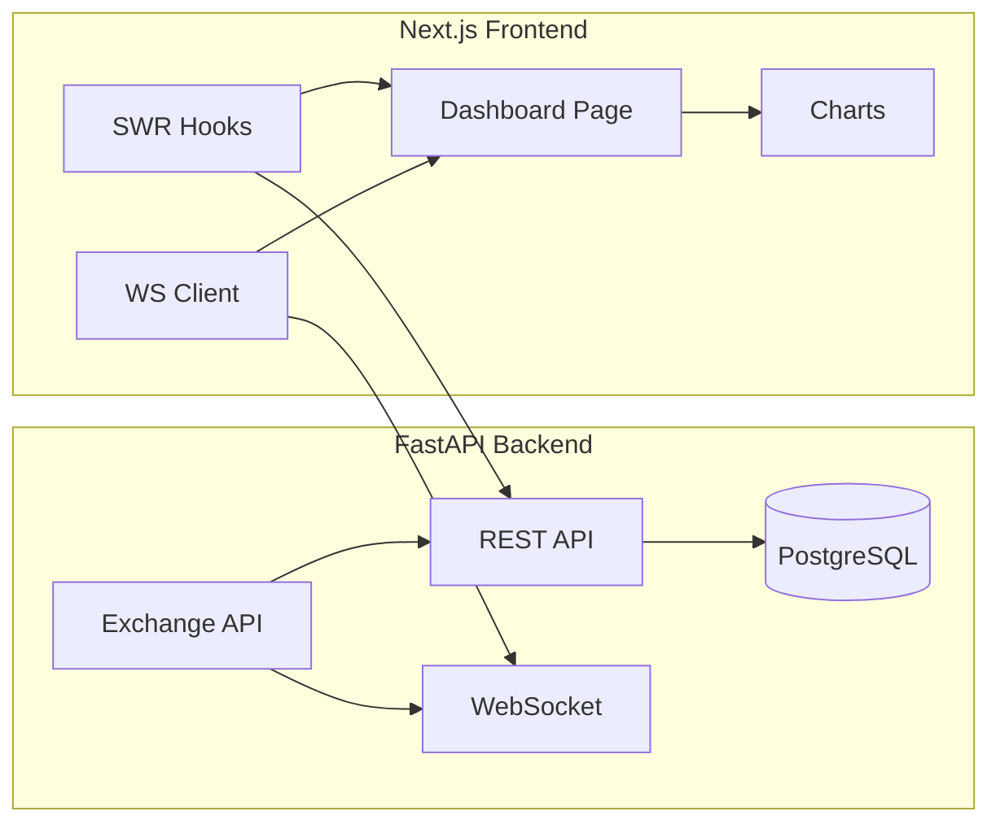

# AI Quant Company 数字孪生 Dashboard 改造计划

## 1. 后端 - 集成交易所 API

### 1.1 安全存储 API 密钥

在 `.env` 文件中添加交易所 API 配置（密钥不要写入代码）:

```bash
# Binance API (只读)
BINANCE_API_KEY=gRXTXvknCvEBFifPsXeYYikZYWZW5f2FMukLeUaQmCyWMp4p27N41xK8TXTD
BINANCE_API_SECRET=UJBhh1vKxJ9p7fhRoxbWp4iqpOLZH2IBVxODOlb3M7ZPo7iS3oG7idPnxeJE8Ma

# OKX API (交易权限，暂时只用于读取)
OKX_API_KEY=a1253993-b8ec-4cf2-a8bf-35d6471cc9e1
OKX_API_SECRET=OD65AED441D6ED2AF9676A231D1F4EB8
OKX_PASSPHRASE=Ymu  # OKX 需要 passphrase
```

### 1.2 改造 [tools/market.py](tools/market.py)

- 添加 `ExchangeManager` 类，支持多交易所切换
- 添加账户余额、持仓查询方法
- 支持 WebSocket 实时价格推送

### 1.3 新增后端 API 端点 ([dashboard/api/main.py](dashboard/api/main.py))

```
GET /api/market/quote/{symbol}      # 实时价格
GET /api/market/ohlcv/{symbol}      # K线数据
GET /api/market/ticker              # 所有币种行情
GET /api/account/balance            # 账户余额
GET /api/account/positions          # 持仓
WS  /api/market/stream              # WebSocket 实时行情流
```

---

## 2. 数据库 - 新增交易所数据表

在 [storage/schema.sql](storage/schema.sql) 添加:

```sql
-- 交易所账户
CREATE TABLE exchange_accounts (
    id UUID PRIMARY KEY DEFAULT uuid_generate_v4(),
    exchange VARCHAR(32) NOT NULL,  -- binance, okx
    account_type VARCHAR(32),       -- spot, futures
    created_at TIMESTAMPTZ DEFAULT NOW()
);

-- 资产快照 (定时记录)
CREATE TABLE balance_snapshots (
    id UUID PRIMARY KEY DEFAULT uuid_generate_v4(),
    account_id UUID REFERENCES exchange_accounts(id),
    asset VARCHAR(32),
    free DECIMAL(24, 8),
    locked DECIMAL(24, 8),
    usd_value DECIMAL(24, 2),
    snapshot_at TIMESTAMPTZ DEFAULT NOW()
);

-- 实时事件流
CREATE TABLE market_events (
    id UUID PRIMARY KEY DEFAULT uuid_generate_v4(),
    event_type VARCHAR(32),  -- price_alert, position_change, agent_action
    symbol VARCHAR(32),
    data JSONB,
    created_at TIMESTAMPTZ DEFAULT NOW()
);
```

---

## 3. 前端 - 数字孪生 Dashboard 重构

### 3.1 设计理念

数字孪生风格: 深色主题 + 实时数据流 + 3D/动态可视化效果，类似交易终端 (TradingView) + 控制室风格。

### 3.2 主界面布局

```
+----------------------------------------------------------+
| [顶部状态栏] 系统时间 | 连接状态 | 总资产 $XXX | 告警数   |
+----------------------------------------------------------+
| [左侧]         | [中央主区域]                | [右侧]    |
| Agent 状态面板 | 实时K线图 + 行情热力图      | 事件流    |
| - CIO 状态    | 多交易对价格监控            | - 最新    |
| - CRO 状态    |                             | - 告警    |
| - 研究员x6    | [下半部分]                  | - Agent   |
|               | 策略/回测进度看板           |   动态    |
+---------------+-----------------------------+-----------+
| [底部] 账户资产分布 | 持仓列表 | 预算消耗进度条         |
+----------------------------------------------------------+
```

### 3.3 新增前端页面/组件

| 文件 | 功能 |

|------|------|

| `src/app/page.tsx` | 重构为数字孪生主控台 |

| `src/components/MarketTicker.tsx` | 实时行情滚动条 |

| `src/components/PriceChart.tsx` | K线图 (用 lightweight-charts) |

| `src/components/AgentStatusPanel.tsx` | Agent 状态面板 (实时心跳) |

| `src/components/EventStream.tsx` | 实时事件流 (WebSocket) |

| `src/components/AssetOverview.tsx` | 账户资产总览 |

| `src/components/HeatMap.tsx` | 币种涨跌热力图 |

### 3.4 数据流架构



---

## 4. 实现顺序

| 序号 | 任务 | 依赖 |

|------|------|------|

| 1 | 配置 `.env` 交易所 API 密钥 | - |

| 2 | 改造 `tools/market.py` 支持真实数据 | 1 |

| 3 | 后端新增 `/api/market/*` 端点 | 2 |

| 4 | 后端新增 `/api/account/*` 端点 | 2 |

| 5 | 后端新增 WebSocket 实时流 | 2 |

| 6 | 安装前端图表库 (`lightweight-charts`) | - |

| 7 | 前端新增 `MarketTicker` 组件 | 3, 6 |

| 8 | 前端新增 `PriceChart` K线组件 | 3, 6 |

| 9 | 前端新增 `AgentStatusPanel` 组件 | 现有 API |

| 10 | 前端新增 `EventStream` WebSocket 组件 | 5 |

| 11 | 前端新增 `AssetOverview` 资产组件 | 4 |

| 12 | 重构 `page.tsx` 主控台布局 | 7-11 |

---

## 5. 技术栈补充

前端新增依赖:

- `lightweight-charts` - TradingView 开源 K 线图库
- `swr` - 数据获取 + 自动刷新
- `socket.io-client` 或原生 WebSocket - 实时数据

后端:

- 现有 `ccxt` 已支持 Binance/OKX
- 需要配置带 API 密钥的私有 API 调用